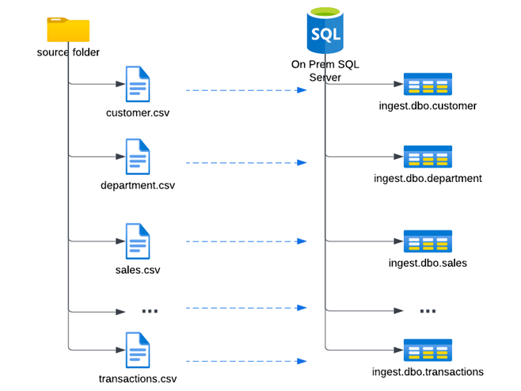
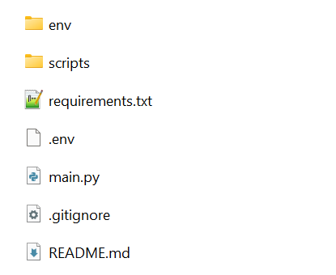

# Files to tables

This is sample solution for this [assignment](https://docs.google.com/document/d/1IE_WVTywDnx_qheE0jcvAR9EQkcvuC46/edit?usp=sharing&ouid=106123598244543505406&rtpof=true&sd=true).

Brief description of the assignment:

<!-- {width:100px} -->


1. Clone this project or download:
```bash
git clone https://github.com/azatovhikmatyor/etl-files-to-tables.git
```

2. Open terminal in project base folder and run this commands:

```bash
python -m venv env
pip install -r requirements.txt
```

3. Create `.env` file in the project folder and write environmental variables in this format below:

```env
SERVER = "SERVER NAME"
DATABASE = "DATABASE NAME"
LOGIN = "LOGIN"
PASSWORD = "PASSWORD"
SOURCE_FOLDER = "SOURCE FOLDER"
```

After this, the project should be in this structure below:



4. To run the project manually, execute this command in terminal:

```bash
python main.py
```

> **Note:** If _SOURCE_FOLDER_ is not set in `.env` file, it can be given as command line argument:

Short form:
```bash
python main.py -s "Source folder path"
```
Long form:
```bash
python main.py --source "Source folder path"
```