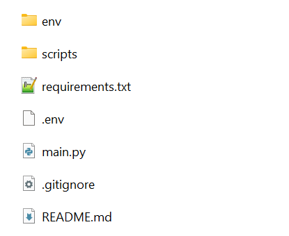

# Files to tables

1. Open terminal in project base folder and run this commands:
```bash
python -m venv env
pip install -r requirements.txt
```
2. Create `.env` file in the project folder and write environmental variables in this format below:
```env
SERVER = "SERVER NAME"
DATABASE = "DATABASE NAME"
LOGIN = "LOGIN"
PASSWORD = "PASSWORD"
SOURCE_FOLDER = "SOURCE FOLDER"
```

After this, the project should be in this structure below:


3. To run the project manually, execute this command in terminal:
```bash
python main.py
```

